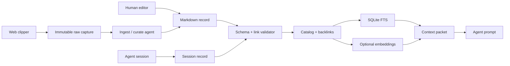

# App-Agnostic Context Layer

**Status:** Design proposed for review
**Date:** 2026-09-23
**Scope:** Agentic Light harness template context, memory, records, linking, and retrieval

## Intent

Create a durable context layer where humans and agents can record project knowledge, decisions, learnings, and session outcomes. Records remain portable, inspectable, version-controlled, cross-linked, and retrievable by future agents regardless of the application being worked on.

Markdown remains the source of truth. Generated catalogs, link maps, full-text indexes, and embeddings are disposable projections.

## Current constraints

- Existing `brain/raw/` captures are immutable.
- Existing `brain/wiki/` pages and `brain/weekly_logs/` remain valid inputs.
- The current semantic cache uses local Ollama and SQLite.
- External target repositories must not receive Agentic Light context unless explicitly opted in.
- The system must work with no hosted service and degrade when Ollama is absent.
- Human-written content must never be silently rewritten or deleted.

## Proposed structure

```text
brain/
├── raw/                    immutable captures
├── records/                typed durable records
│   ├── projects/
│   ├── decisions/
│   ├── learnings/
│   ├── references/
│   └── sessions/
├── wiki/                   existing entity pages
├── weekly_logs/            dated working records
└── index/                  generated, gitignored projections
    ├── catalog.json
    ├── links.json
    └── memory.sqlite3
```

The existing wiki is not migrated wholesale in the first phase. It becomes a legacy-compatible record source while new durable knowledge uses `brain/records/`.

## Record contract

Every record has this common frontmatter:

```yaml
---
id: context-layer-design
type: decision
title: App-Agnostic Context Layer
status: active
scope: workspace
projects:
  - agentic-light
tags:
  - context
  - architecture
created: 2026-09-23
updated: 2026-09-23
author: human
source:
  - brain/raw/2026/W39 Sep 21-27/context-layer.md
related:
  - [[context-packet]]
  - [[memory-index]]
---
```

Supported types:

| Type | Purpose | Required body sections |
| --- | --- | --- |
| `project` | Durable project identity and state | Summary, Goals, Status, Links |
| `decision` | Chosen direction and tradeoffs | Decision, Alternatives, Rationale, Consequences |
| `learning` | Reusable insight | Situation, Insight, Evidence, Reuse When |
| `reference` | External or raw source | Summary, Source Details, Notes |
| `session` | Agent or human work outcome | Task, Outcome, Changed, Unresolved |

Required fields are validated, not inferred at write time. Optional fields may be added without breaking older records.

## Linking model

Links have two representations:

1. Human-readable Markdown wikilinks in the body, such as `[[context-layer]]`.
2. Explicit frontmatter relations for machine retrieval, such as `projects`, `source`, and `related`.

The cataloger resolves both into `links.json`:

```json
{
  "source": "brain/records/learnings/hybrid-retrieval.md",
  "target": "brain/records/decisions/context-layer.md",
  "relation": "related",
  "origin": "frontmatter",
  "confidence": 1.0
}
```

The validator reports broken links, duplicate IDs, duplicate titles, orphan records, missing provenance, invalid types, and sources with no consumers.

## Human-record curation

An agent may take a human-authored record and perform linking as a bounded curation task.

```text
Human record
  → candidate search across records, wiki, logs, and sources
  → lexical + semantic matching
  → confidence classification
  → validated proposal
  → human review or explicit apply
  → catalog and index rebuild
```

Interface:

```sh
context curate brain/records/learnings/example.md --suggest
context curate brain/records/learnings/example.md --apply
context curate brain/records/learnings/example.md --review
```

`--suggest` is the default. It produces a patch or companion proposal without altering the source record. `--apply` may add frontmatter relations, inline wikilinks, and generated index entries, but may not rewrite the human's core prose. `--review` displays unresolved and low-confidence candidates.

High-confidence links are exact ID or source matches. Medium-confidence links require a reviewable proposal. Low-confidence matches are reported only and never applied automatically.

Each applied curation creates a session record containing the input path, candidate links, accepted links, rejected links, agent identity, and timestamp.

## Catalog and search

Introduce a catalog command that scans all supported context sources and emits generated projections:

```text
catalog.json  → metadata, paths, types, projects, timestamps
links.json    → forward links, backlinks, unresolved targets, orphans
memory.sqlite3 → FTS5 rows and optional embedding vectors
```

Search uses this order:

1. SQLite FTS5 lexical search.
2. Local semantic search when the embedding provider is available.
3. Reciprocal-rank merge of lexical and semantic results.
4. `rg` fallback when the catalog or embedding service is unavailable.

Results include a score, record type, title, project, updated date, path, and a bounded excerpt. Search never returns only opaque paths to the context packet.

The embedding model and dimension are recorded per row. A model change forces re-indexing, preserving the existing dimension-safety behavior.

## App profiles and context packets

The packet builder becomes profile-driven rather than Agentic Light-specific. Profiles define the context root, project identity, roadmap path, default scopes, and maximum packet size:

```yaml
name: agentic-light
context_root: brain
default_scopes:
  - project
  - decision
  - learning
  - session
roadmap: ROADMAP.md
```

Example interface:

```sh
context packet \
  --query "improve project persistence" \
  --project agentic-light \
  --scope project,decision,learning,session \
  --top 8 \
  --max-bytes 12000
```

The packet contains labeled excerpts and provenance. It includes a roadmap only when the active profile names one. External repositories remain default-off and receive context only with explicit opt-in.

## Write safety and authority

- `raw/` remains immutable.
- Human core prose is preserved during curation.
- AI additions identify author and source session.
- Existing records are appended or patched, never silently replaced.
- Contradictions remain visible and are recorded as competing claims.
- Stale records are marked rather than deleted.
- Paths are confined to the configured context root.
- Secret scanning runs before a record is accepted.
- Every generated projection is rebuildable from Markdown.

## Data flow



## Rollout

1. Add schemas, sample records, validator, and catalog fixtures.
2. Extend indexing and search to records, wiki pages, weekly logs, and sources.
3. Add excerpts, provenance, and hybrid lexical/semantic ranking.
4. Make context packets profile-driven while preserving the current CLI as a compatibility wrapper.
5. Add `context curate` in suggest/apply/review modes.
6. Capture agent session outcomes and project state changes.
7. Backfill only high-value existing wiki and weekly-log material.
8. Add failure-mode tests for broken links, stale records, unavailable Ollama, unrelated app profiles, packet-size limits, and provenance preservation.

## Explicit non-goals

- Hosted vector databases.
- A graph database.
- Background daemons or automatic schedulers.
- Silent rewriting of human records.
- Full event sourcing.
- One rigid body schema for every document.

## Acceptance criteria

- A human can add a Markdown record with a normal editor.
- An agent can discover and link that record to existing knowledge.
- Curation defaults to a reviewable proposal.
- Applied links are validated and recorded with provenance.
- Search returns relevant excerpts across all supported record classes.
- Context packets are app-profile-driven, bounded, and source-traceable.
- The entire catalog and search cache can be deleted and rebuilt.
- Existing raw, wiki, weekly-log, and external-repository safety behavior remains intact.
